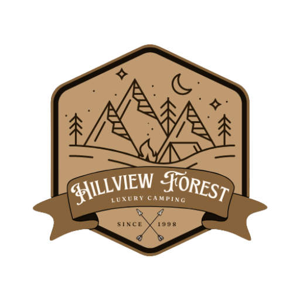

# Hillview Forest - Project 1

## About

Hillview Forest website is a Front-End project created to emulate a real-life website for a business from a full-stack student perspective. Although Hillview Forest is a fictional business, the goal of this project is to create an interactive website that provides useful information and promotes the brand, targeting potential new customers.

The website was developed using HTML and CSS, showcasing the skills and knowledge gained during the full-stack development course. It serves as a demonstration of the ability to create a visually appealing and functional website.

## Characteristics

The website is divided into 4 pages with a header banner, a main menu, and a footer positioned equally. Each page serves a specific purpose and provides relevant information to the users.

### Landing Page

The landing page is designed to make a strong first impression and engage visitors. It features stunning visuals of the natural surroundings and a compelling headline that captures the essence of Hillview Forest. The page provides an overview of the business, highlighting its unique selling points and the benefits customers can expect when choosing their services. It also includes information about the business's mission and values, giving users a sense of the brand's identity.

### Accommodation

The accommodation page showcases the different types of cabins and tents available for rent at Hillview Forest. It includes high-quality images and detailed descriptions of each accommodation option, allowing potential customers to make informed decisions based on their preferences and needs. The page highlights the amenities and features of each accommodation, such as comfortable beds, cozy firewood heaters, fully furnished interiors, electricity access, and more. It aims to create a desire for customers to experience the tranquility and luxury of staying in Hillview Forest's accommodations.

1[Tents](assets/media/images/readme/tents-tablet-size.jpg)

### Useful Info

The Useful Info page provides visitors with essential information to plan their visit to Hillview Forest. It includes details about the business's opening times, ensuring that potential customers can plan their stay accordingly. The page features an interactive map displaying the exact location of Hillview Forest, making it convenient for visitors to find their way.

1[Map-Info](assets/media/images/readme/maps-info.jpg)

### Contact

The Contact page offers various methods for customers to get in touch with Hillview Forest. It provides contact details, including phone numbers and email addresses, ensuring that customers can reach out for inquiries, bookings, or any other information they may need. The page also includes a user-friendly contact form that allows visitors to send direct messages to the business. This form collects necessary information, such as the visitor's name, email address, subject, and message..

### Thank You Page

After submitting a message through the contact form, users are redirected to a Thank You page. This page expresses gratitude for contacting Hillview Forest and assures users that their message has been received. 

### 404 Error Page

In the event that a visitor encounters a page not found error, the 404 Error page provides a friendly and informative message. It apologizes for the inconvenience and suggests navigating back to the homepage or using the website's main menu to find the desired content.

### Footer

The footer is present on most pages of the website and contains icons with links to relevant social media websites. This allows visitors to easily access Hillview Forest's social media profiles, promoting engagement and enabling users to stay connected with the business. The footer also includes a copyright notice and any necessary legal information to protect Hillview Forest's intellectual property rights.

### The Root

The project directory consists of six HTML pages: index.html, accommodation.html, useful-info.html, contact.html, thank-you.html and 404.html. CSS stylesheets were used to define the visual appearance and layout of the website. The media assets, including images and icons, are stored in appropriately organized folders within the project directory. The HTML code was structured following best practices and accessibility standards, ensuring that the website is user-friendly.
This project was designed with adaptability for PC, Tablet and Mobile.

## Source

- Map: The interactive map displayed on the Useful Info page is sourced from Google Maps, providing accurate location information to visitors.
- Icons: The website utilizes icons from Font Awesome, enhancing the user experience and providing intuitive visual cues.
- Images: The high-quality images used throughout the website are sourced from Pexels. These images help to visually represent the beauty and ambiance of Hillview Forest.

## Frameworks - Libraries - Programs Used

- Google Fonts: The project incorporates fonts from Google Fonts, enhancing the typography and overall visual appeal of the website.
- Font Awesome: The Font Awesome library is utilized to add icons to the website, improving the user interface and providing visual cues.
- GitHub: The project code is hosted on GitHub.
- PIXLR: PIXLR was employed to create, modify, and resize images used on the website.
- Canva: Canva was used to create the logo, favicon, and other visual assets.
- W3C Markup Validator: The W3C Markup Validator was used to validate the HTML code and ensure compliance with web standards.
- W3C CSS Validator: The W3C CSS Validator was used to validate the CSS code and ensure a consistent and error-free style.
- Google Lighthouse: Google Lighthouse was used to test the website's performance, best practices, accessibility, and SEO on both desktop and mobile devices.

## Functionality

- All links have been tested for accessibility by hovering and clicking.
- All pages load correctly on all device screen sizes.
- All social media links work correctly and open in a new tab.
- All images load on each page as intended.
- All buttons are functional and direct users to their intended functions.

## Website Development Issues

Throughout the development process, a few challenges were encountered and resolved. One particular issue was related to the implementation of the hamburger menu, which required careful attention to ensure proper functionality and responsiveness across different devices. This issue was resolved thanks to the help of  my mentor.

Additionally, using Git for version control posed some initial difficulties, but with the assistance of my mentor, the issues were successfully resolved.

## Credits

- W3Schools
- [Hamburger Menu](https://codepen.io/erikterwan/pen/EVzeRP): The code for the hamburger menu was obtained from CodePen and customized to fit the project's design and functionality.
- Stack Overflow: Various questions and answers from Stack Overflow were consulted to address specific coding challenges.
- Special Thanks to my tutor Gareth McGirr for all the help

Content
- All text content is is original.
- The quote in the landing page is from Kahli Gibran.

